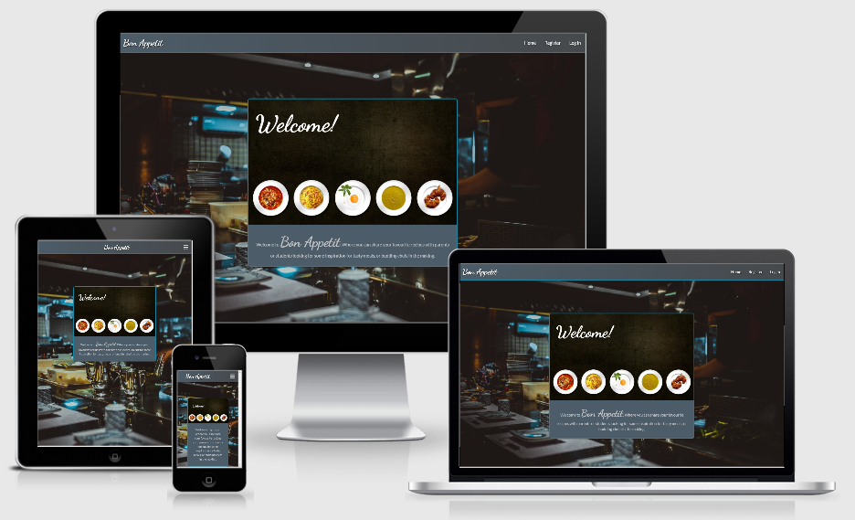

# [Bon Appetit](https://ba-cook.herokuapp.com/)

A website for sharing and commenting on recipes.



## Table of Contents
1. [**UX**](#ux)
    - [**Wireframes**](#wireframes)
    - [**Project Goals**](#project-goals)
    - [**Player Goals**](#player-goals)
    - [**Developer Goals**](#developer-goals)
    - [**User Stories**](#user-stories)
    - [**Design Choices**](#design-choices)

2. [**Features**](#features)
    - [**Existing Features**](#existing-features)
    - [**Features Left to Implement**](#features-left-to-implement)

3. [**Technologies Used**](#technologies-used)

4. [**Testing**](#testing)
    - [**Tested Devices**](#tested-devices)
    - [**Laptop Testing**](#laptop-testing)
    - [**Smartphone Testing**](#smartphone-testing)
    - [**Validation Services**](#validation-services)
    - [**Bugs Discovered**](#bugs-discovered)

6. [**Deployment**](#deployment)
    - [**How to deploy this project to Heroku**](#how-to-deploy-this-project-to-Heroku)

7. [**Credits**](#credits)
    - [**Code**](#code)
    - [**Media**](#media)
    - [**Acknowledgments**](#acknowledgments)

8. [**Disclaimer**](#disclaimer)

## UX

### Wireframes

Wireframes for the project were created at [Figma](https://www.figma.com) and those for this project can be found [here](https://www.figma.com/file/V4hn1tOIEUD7Fw5bSUdZcl/MS3-Project---Bon-Appetit?node-id=2%3A6114)

### Project Goals  
  
The aim of the project was to create a website where users would be able to share recipes with one another and comment on the recipes that they enjoyed to build a community on the site.  
  
### User Goals  
  
User goals are:  
- Find new recipe ideas.  
- Share new recipe ideas with others.  
- Leave comments for others about which recipes they like, and why.  
- Have feedback from the community on recipes they have submitted.
- Be able to navigate the site intuitively.  
  
[Bon Appetit](https://ba-cook.herokuapp.com/) achieves this by:    
- Allowing user to have their own profile areas.  
- Having an intuitive design and layout whereby the user can quickly learn how to navigate the site and contribute by adding recipes and comments. 
- Having comments linked to recipes so they can see what other users have said about them.
- Having the management of their own submitted recipes and comments on their profile page to allow them to edit or delete them. 
  
### Developer Goals  
  
- To enable CRUD operations for a website, allowing users to register and update information to a database.  
- Design a useful, functional website to further implementation of CRUD functionality for a website. 
- Expand upon previous skills to add increased functionality to website design. 
- Expand portfolio to showcase new skills.
 
### User Stories  
  
Being a user that is interested in sharing recipes within a community:  
  
1. To be able to share recipes with other users quickly and easily. This process was achieved by having a simple form that users can fill out to store their recipes online. I elected to have the recipe categories limited to a drop down selection to limit the amount of potential categories within the database. 

2. To be able to edit and delete recipes whenever necessary. I achieved this by containing all the submitted recipes on their own profile with buttons for CRUD functionality such editing and deleting. I also elected to have a confirmation modal for deletions to minimise the chances of accidental deletions.  

3. To be able to add comments to recipes that I like to create a welcoming community experience. When viewing recipes I wanted users to have the ability to comment on the recipes to share their experience of what they liked about the recipe, and to post their suggestions for how to improve or alter the recipes. To do this I added an add comment form to the individual recipe page. 

4. To be able to edit and delete comments whenever necessary. This again was achieved through the profile page where all of the users comments are presented with CRUD buttons to edit and delete their own comments. The edit button will take users to a form where their comment can be edited, I elected to utilise a modal to confirm deletion of the comment to minimise erroneously deleting comments.   

5. To be able to quickly see all the recipes and comments I have shared. As stated above, I chose to display all of this information within the individual users profile. This allowed them to keep track of all of their contributions in one place, and to edit or delete them whenever required without having to scour the individual recipes. 

6. To have an intuitive site that is easy to follow. This was achieved by having a typical site navigation using a navbar located at the top of the screen. I tried to keep the nav menu and buttons self explanatory, to limit any potential confusion.  

7. To have a site that is responsive and good to look at while using it. To achieve a responsive website I chose to use the MaterializeCSS framework to get out of the box responsiveness using their responsive classes. This allowed me to give users a similar experience whatever their chosen device. The colours chosen for the website were chosen to reflect those of kitchen utensils and appliances.  
  
### Design Choices  
  
1. **Fonts**  
Fonts were selected from [Google Fonts](https://fonts.google.com/). All were chosen as they paired well together. 
    - _Lato_: The font used for the body text and buttons was chosen as it was easy to read, pairs well with _dancing script_, and is a font that I am familiar with,,, having used it on previous projects. It provides a clean and easily legible font at all sizes.  
    - _Dancing script_: Was used for the site logo, as well as the header elements. I chose  this particular font due to looking more handwritten. I thought that this would provide users a more human, friendly aspect to the site. Perhaps to provide a more _"homely"_ feel to it. 
  
2. **Buttons**  
Buttons used the majority of [Materialize's](https://materializecss.com/) styling and functionality with a custom blue colour added for the mouseover functionality to improve the user experience. The text color of the buttons also used that of the rest of the fonts on the site to tie it in better with the colour scheme, and a custom text shadow effect was used to make this stand out better and make the buttons appear less flat.   
 
3. **Colors**  
I wanted the site to have a monochromatic feel to it to tie in with the chrome/silver/black that is often found with kitchen utensils and equipment. I elected to also use a bright blue to give a bit more contrast to certain elements to make them stand out more and be hightlighted better. The colour scheme I chose can be found [here](https://coolors.co/dcdcdd-c5c3c6-46494c-4c5c68-1985a1).
  
4. **Images**  
Images were chosen to fit with the theme of the website. 
    - _Food Images_: Stock photo images of dishes that I felt were representative of particular cuisines were chosen for the cuisine cards for the browse template to give users a visual representation of the type of cuisine. Both for those unfamiliar with it, and also to provide a nice image to engage the user to dig deeper. The images are generated dynamically onto the cards using _Jinja_.  
    - _Background Image_: Is that of a kitchen, to give the user an image associated with recipes and cooking. I selected the particular image as it was quite dark and tied in well with the monochromatic colour scheme I was using for the site.  
  
6. **Styling**  
The website style is inspired by kitchen equipment and utensils, with a monochromatic, functional aesthetic.
    - _Monochromatic Theme_: This theme was chosen to give the user the feeling of cookware and kitchens. As it is a scheme that I feel many people would be familiar with from the different products they have in their own homes.  
    - _Modals_: Modals were used to provide checks for cancellation messages, for ease of use and to force the user to confirm their intention to prevent accidental deletion of database entries.
 
## Features  
  
The website follows a one page design with accompanying modals to maintain a clutter free environment and guide the flow of the game.
  
### Existing Features  
  
1. **Flask**  
[Flask](https://flask.palletsprojects.com/en/1.1.x/) framework is used to allow the use of other functionality of the site, such as the _Jinja_ templating and _Werkzeug_ security features.

2. **Jinja Templates**  
Are used to allow ease of navigation throughout the site. Using inheiritance of the base template to eliminate the need for duplication of common features of the website, such as the navbars.
  
3. **User Verification**  
Users must sign up to the website to be able to use the features. Registration requires users to submit a username and password that conforms to the requirements of length and characters to make it more secure. This data is then stored on the [MongoDB](https://www.mongodb.com/) database using password hashing to provide security.

4. **CRUD functionality for recipes**  
To allow users to add, edit, view and delete recipes that they have added themselves, as well as view those shared by others.

5. **CRUD Functionality for Cuisines(admin only)**
To allow admins the ability to add new cuisines when required that will dynamically appear as options for users to select for their new added recipes.

6. **CRUD Functionality for Comments**
To allow users to add, edit, view and delete comments that they wish to share with the community about their favourite recipes. Other users are also able to view the comments for particular recipes on the recipes page itself.

### Features Left to Implement  
  
1. **Star Ratings**  
To allow users to submit a star rating alongside their comments that would then provide each recipe an average user based rating score so that people would be able to easily see which recipes are the most popular. This could also coincide with an additional search perameter for user to search for the highest rated recipes.

2. **Cookware**  
To provide each recipe with a list of required cookware for preparing it, with a pop-up image to show users what it is, and also a link to where it could be purchased from.

3. **More Intricate Scoring System**  
Redesigning the scoring system so that points are generating by each correct matching of an individual image rather than a complete sequence. This would allow for a more diverse score to be generated.

## Technologies Used  
  
- **Languages**  
    - [HTML5](https://devdocs.io/html/)
    - [CSS3](https://devdocs.io/css/) 
    - [JavaScript](https://devdocs.io/javascript/)
    - [Python](https://www.python.org/)
  
- **Libraries**  
    - [JQuery](https://jquery.com) - used to simplify DOM manipulation, and make the JavaScript easier to read. 
    - [Google Fonts](https://fonts.google.com/) - provided the fonts for the website to make the text more interesting.  
  
- **Frameworks**  
    - [Materialize](https://materializecss.com/) - used to create an easily responsive design for all screen sizes.  
  
- **Cookies**  
    - [Cookies](https://developer.mozilla.org/en-US/docs/Web/HTTP/Cookies) - were used to store the session user so they can remained logged in. This became key to much of the code to show users their own personalised profile area.  
    
- **Services**  
    - [GitPod](https://www.gitpod.io/) - the IDE used exclusively to create the website.  
    - [Git](https://git-scm.com/) - for version control.  
    - [GitHub](https://github.com/) - to store the repository online and host the finished website.
    - [Heroku](https://www.heroku.com/) - used to deploy the website.
    - [MongoDB](https://www.mongodb.com) - used to host the database necessary for the project to function.
    - [Chrome DevTools](https://developers.google.com/web/tools/chrome-devtools) - used mainly for checking responsiveness of the website throughout the development process and to address bugs and error messages with code.  
    - [HTML Validator](https://validator.w3.org/) - used to test the final HTML code and address improper syntax.  
    - [CSS Validator](https://jigsaw.w3.org/css-validator/) - used to test the final CSS code and address improper syntax.  
    - [JSHint](https://jshint.com/) - used to test the final JavaScript code and address improper syntax.  
    - [Am I Responsive?](http://ami.responsivedesign.is/) - used to provide a visual representation of the responsiveness of the game across all platforms. 
  
- **Software**  
    - [Paint.net](https://www.getpaint.net/) - used to crop and resize the original animal images to better fit the image display box. 
  
  
## Testing  
  
### Tested Devices  
The majority of the testing was conducted on the desktop PC via [Chrome DevTools](https://developers.google.com/web/tools/chrome-devtools).    
  
```  
| -----------|---------------------------- |------------------------------|  
| Type       | Device                      | Browsers                     |  
| -----------|---------------------------- |------------------------------|  
| Desktop    | Windows 10, 1080p display   | Chrome, Firefox, Edge, Opera |
| Laptop     | Asus X550C                  | Chrome, Firefox, Edge, Opera |  
| Smartphone | Samsung Note 9              | Chrome, Firefox              |  
| Smartphone | Huawei P30 Pro              | Chrome, Firefox              |  
| Smartphone | Samsung Tab E               | Chrome                       |    
| -----------|---------------------------- |------------------------------|  
```  
  
### Testing Process
The following process was conducted for all devices, with the desktop and laptop process repeated twice and higher and lower resolutions.  
  
1. **User Functionality**  
    - Open the website and ensure that the welcome page displays correctly.  
    - Ensure that navbars contain the correct links for an unregistered user.  
    - Ensure the registration page displays correctly.  
    - Ensure ensure registration functionality is working.  
    - Close browser window and open again to ensure the username still displays and the correct links are visible on the navbar.  
    - (Desktop and laptop only) Hovered the mouse over the buttons on the profile page to ensure the animation occured. 
    - Ensured the logout link worked and returned to the login page.
    - Ensured the login link worked and the login page displayed correctly.
    - Ensured login functionality worked correctly.
    - Ensured profile page displayed correct recipes and comments.
    - Ensured all profile page buttons were working..
    - Ensured confirmation delete modal was displaying for deletion of comments and recipes.  
  
2. **Recipe CRUD Functionality**  
    - Ensured the add and edit pages displayed correctly.
    - Ensured the add and edit page buttons worked correctly.
    - Ensured the add and edit functions added and updated the correct entries on the databse.
    - Ensured the delete button displayed the modal.
    - Ensured the delete function worked on the correct entry, and only after confirmation from clicking the modal button.
    - Ensured the recipes and comments added were displayed correctly on the appropriate pages.
    
2. **Cuisine CRUD Functionality**  
    - Ensured the add and edit pages displayed correctly.
    - Ensured the add and edit page buttons worked correctly.
    - Ensured the add and edit functions added and updated the correct entries on the databse.
    - Ensured the delete button displayed the modal.
    - Ensured the delete function worked on the correct entry, and only after confirmation from clicking the modal button.
    - Ensured the recipes and comments added were displayed correctly on the appropriate pages.
    - Ensured the functionality was only available to those with admin authority.

3. **Comment CRUD Functionality**  
    - Ensured the add and edit pages displayed correctly.
    - Ensured the add and edit page buttons worked correctly.
    - Ensured the add and edit functions added and updated the correct entries on the databse.
    - Ensured the delete button displayed the modal.
    - Ensured the delete function worked on the correct entry, and only after confirmation from clicking the modal button.
    - Ensured the recipes and comments added were displayed correctly on the appropriate pages.
    
### Validation services  
Upon completion of the project the code was checked using the following resources and the corresponding feedback acted upon where appropriate.  
- [HTML Validator](https://validator.w3.org/) - Errors shown are mostly related to Jinja templating, however there were some additional issues. One found on the base.html page where the validator stated the head, title and body tags were incorrectly used though they were all used correctly. Another issue was related to the use of one unordered list within another, which was used as per the documentation of the Materialize templating to allow for a dropdown list within the navbar. There were some errors relating to a div element being a child of a ul element, which was fixed. There was also an error with the browse.html where the jinja templating wasn't creating unique id's for each iteration, so some additional jinja code was input to ensure each was a unique id.
- [CSS Validator](https://jigsaw.w3.org/css-validator/) - many errors shown, but were relating to the various CDN sources.
- [JSHint](https://jshint.com/) - checked the javascript, no errors were shown.  
- [PEP8 Online Check](http://pep8online.com/) - checked the pyhton code and corrected all errors that were shown.  

  
### Bugs Discovered  
- A bug was found with the 404 and 500 error handling whereby all errors would return as 404 errors. This was fixed to return the correct template for each situation.
- Fixed bugs where incorrect recipes were returned.
- There are no further known bugs at present.  
  
## Deployment  
  
[GitPod](https://www.gitpod.io/) was the sole IDE used to deveop this project due to the synergy with [Git](https://git-scm.com/) and [GitHub](https://github.com/) for the hosting of repositories and version control.  
  
Bon Appetit was deployed via [Heroku](http://ba-cook.herokuapp.com/) from its [GitHub repository](https://github.com/AJBayliss81/bon-appetit). This can be achieved by:  
1. Logging in to [Heroku](https://www.heroku.com).  
2. Clicking on the "new" button towards the top right of the dashboard, beneath the search bar, and selecting the "create new app" from the dropdown menu.
3. Input a new name for the project which must be unique, and select a region closest to your own.  
4. Click on the "create app" button at the bottom of the form.  
5. When taken to the next page select the "connect to GitHub" option from the deployment methods towards the centre of the page . 
6. Before continuing, ensure that both Procfile and requirements.txt files are included in the required repository for deployment. If they are not created already the requirements.txt can be created by using the command "pip3 freeze > requirements.txt" in the terminal of your chosen IDE. The procfile can similarly be created by either right clicking on the file management window and selecting "new file", or navigating to the menu > file > new file. When inputting the name ensure the Procfile is capitalised.
7. Search for the repository name from below the deployment options to find the correct repository.
8. Once the app is connected to the desired repository you can select whether to enable automatic deploys on Heroku whenever the repository code is changed by clicking the "Enable Automatic Deploys" button from the automatic deploys section beneath the app connection section.
9. Scroll back to the top of the page and select "settings" from the navbar.
10. In the second "Config Vars" section click the "Reveal Config Vars" button.
11. Enter all the key:value pairs that were used during the development of the project.
12. Once completed scroll to the top and select the "Deploy" option again from the navbar.
13. Scroll to the bottom "Manual Deploy" section and select the branch of the repoistory to deploy to Heroku, clicking on the "Deploy Branch" button once done.
14. Wait while the deployment takes place. When completed a message at the bottom of the page will display "Your app was successfully deployed".
15. Either click the "View" button displayed beneath the completion message, or scroll to the top of the page and click the "Open app" button to view the now deployed site. 
  
## Credits  
  
### Code  
  
- [StackOverflow](https://stackoverflow.com/) was used extensively to research solutions to problems I was having with getting the desired result from the code when it wasn't behaving as I had intended.  
  
### Media  
  
- The images found for use on the site can be found and used royalty free from [Unsplash](https://unsplash.com/).

### Acknowledgments 
    
- [Code Institute](https://codeinstitute.net/) tutors and support for assisting with some issues during the creation of this project.
  
